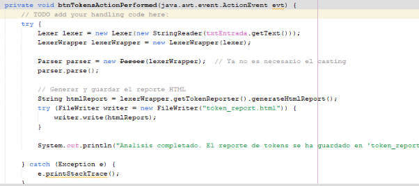
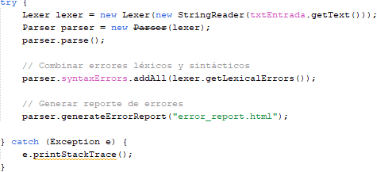
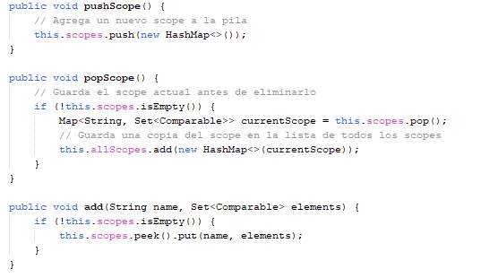

Raudy Cabrera - 201901973

# **MANUAL DE USUARIO ConjAnalyzer**

El curso de Organización de Lenguajes y Compiladores 1, perteneciente a la Facultad de Ingeniería de la Universidad de San Carlos de Guatemala, requiere de usted, como conocedor de la construcción de analizadores Léxico y Sintáctico, crear un sistema que sea capaz de realizar operaciones entre conjuntos para que los estudiantes del curso Matemática para Computación 1 puedan verificar las respuestas de sus tareas y exámenes del curso.

*Objetivos Generales*

- Aplicar los conocimientos sobre la fase de análisis léxico y sintáctico de un compilador para la construcción de una solución de software.
- Aprender a generar analizadores léxicos y sintácticos utilizando las herramientas de JFLEX y CUP.
- Aprender los conceptos de token, lexema, patrones y expresiones regulares.
- Realizar correctamente el manejo de errores léxicos.
- Realizar acciones gramaticales utilizando el lenguaje de programación JAVA.

**Vista de la aplicación**

**Funcionalidades Archivo**

- Nuevo Archivo: se podrá crear un nuevo archivo con extensión [ .ca ].
- Guardar: nos permitirá guardar el archivo actual
- Guardar como: nos permitirá guardar el archivo con otro nombre.
- Cargar Archivo: nos permitirá cargar los archivos de forma externa con extensión [.ca].

**Reportes**

- Reporte de Tokens: se generará un html con todos los tokens reconocidos en el analizador léxico.
- Reporte de Errores: se generará un html con todos los errores léxicos y sintácticos encontrados.

**Entrada**

- Caja de texto donde se debe colocar las instrucciones para la ejecución.
- Ejecutar: Realizará la compilación de la entrada de texto y mostrará los resultados en la consola.

**Gráficas**

Mostrará las imágenes de las operaciones realizadas. **Consola**

Mostrará únicamente el resultado de las evaluaciones realizadas en la entrada.

# **MANUAL TÉCNICO ConjAnalyzer**

El curso de Organización de Lenguajes y Compiladores 1, perteneciente a la Facultad de Ingeniería de la Universidad de San Carlos de Guatemala, requiere de usted, como conocedor de la construcción de analizadores Léxico y Sintáctico, crear un sistema que sea capaz de realizar operaciones entre conjuntos para que los estudiantes del curso Matemática para Computación 1 puedan verificar las respuestas de sus tareas y exámenes del curso.

*Objetivos Generales*

- Aplicar los conocimientos sobre la fase de análisis léxico y sintáctico de un compilador para la construcción de una solución de software.
- Aprender a generar analizadores léxicos y sintácticos utilizando las herramientas de JFLEX y CUP.
- Aprender los conceptos de token, lexema, patrones y expresiones regulares.
- Realizar correctamente el manejo de errores léxicos.
- Realizar acciones gramaticales utilizando el lenguaje de programación JAVA.

Clases Utilizas:

Clases de raiz

Main: Solo inicia el Jframe de la aplicación.

Analyzer: es el Jframe con la interfaz de la aplicación. En esta se realiza todas las funciones del compilador. como el método de carga de archivo:

Uno de los métodos más importantes es el ejecutar, que realiza la compilación léxica y sintáctica, más adelante se detalla cada una de estas.

El método para generar los reportes de tokens:

El método para generar los reportes de errores:

Clase de Lexer:

La clase Lexer es un analizador léxico que identifica y clasifica tokens en un texto según patrones predefinidos. Detecta errores léxicos, maneja comentarios de una línea y multilínea, y ignora espacios en blanco y caracteres inválidos.

Clase Parser:

La clase Parser convierte tokens en una estructura de datos (AST), maneja errores sintácticos y genera informes de errores en HTML. Define cómo construir declaraciones, operaciones y bloques a partir de los tokens.

Clase TokenReporter:

La clase TokenReporter recopila y reporta información sobre tokens. Almacena detalles de cada token como su lexema, tipo, línea y columna, y genera un informe en HTML que muestra esta información en una tabla.

Clase SetDefine:

La clase SetDefine representa una instrucción para definir un conjunto en el lenguaje. Al ejecutarse, agrega el conjunto y sus elementos a una tabla de símbolos y muestra un mensaje en la consola. También genera una representación gráfica del conjunto para su visualización en un gráfico, mostrando el nombre del conjunto y sus elementos.

Clase SetOperation:

La clase `SetOperation` ejecuta y simplifica operaciones de conjuntos, y genera reportes en JSON. Evalúa las operaciones, aplica simplificaciones, guarda resultados en una tabla de símbolos y escribe un archivo JSON con la información de las operaciones.

Clase SetReference:

La clase SetReference representa una referencia a un conjunto en una tabla de símbolos. Evalúa y retorna el conjunto asociado al nombre dado. Además, genera una representación gráfica del nombre del conjunto y proporciona una forma de imprimir su evaluación

Clase SetEvaluation:

La clase `SetEvaluation` evalúa si ciertos elementos están presentes en el resultado de una operación. Si la operación no está definida, muestra un mensaje de error. Imprime el resultado de la evaluación en la consola.

Clase Union:

La clase `Union` representa una operación de unión entre dos conjuntos. Evalúa la unión de los conjuntos representados por `op1` y `op2`, generando un conjunto que contiene todos los elementos de ambos. También genera una representación gráfica y un formato de impresión de la operación.

Clase Intersection:

La clase `Intersection` representa una operación de intersección entre dos conjuntos. Evalúa la intersección de los conjuntos proporcionados por `op1` y `op2`, generando un conjunto que contiene solo los elementos que están en ambos conjuntos. También genera una representación gráfica y un formato de impresión para la operación.

Clase Difference:

La clase Difference representa una operación de diferencia de conjuntos. Evalúa la diferencia entre dos conjuntos, donde op1 es el conjunto del que se restan los elementos de op2. Además, proporciona una representación gráfica de la operación y un formato de impresión para la operación.

Clase Complement:

La clase Complement representa una operación de complemento de conjuntos. Calcula el complemento de un conjunto dado op, lo cual se realiza restando los elementos de op de un conjunto universal predefinido. Además, proporciona métodos para la representación gráfica de la operación y su formato de impresión.

Clase SymTable:

El código de la clase SymTable define una tabla de símbolos que maneja diferentes ámbitos (o scopes) para almacenar conjuntos de elementos asociados a nombres

